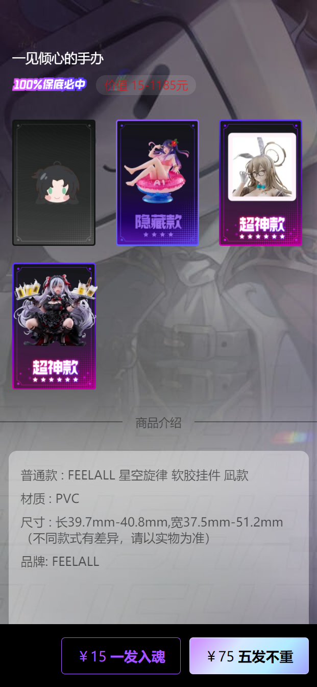
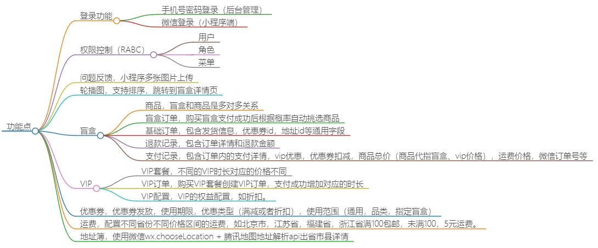

# 项目介绍

本项目模仿b站的魔力赏盲盒，每个盲盒中可以添加多个商品，支付成功后根据概率随机挑选盲盒内的商品。同时加入了VIP，优惠券，运费计算等功能。

## 项目预览
<div style="display: flex;align-items: center;justify-content: space-around;flex-wrap: wrap">




</div>


## 功能点



## 全功能手册（推荐）

**完整功能清单、使用方法与操作步骤**（含 App / 管理端 / 后端、启动、打包、测试账号），见：

- **[docs/项目全功能手册.md](docs/项目全功能手册.md)** — 主文档，功能变更时请同步更新 §0.2 更新记录
- [docs/README.md](docs/README.md) — 文档目录索引


## 技术栈

### 手机 App 端

当前移动端为 `React Native + Expo` 的独立手机 App。

| 技术 | 说明 | 官网 |
| --- | --- | --- |
| React Native | 跨平台移动端框架 | <https://reactnative.dev/> |
| Expo | RN 工程工具链与运行时 | <https://expo.dev/> |
| TypeScript | 让 JS 具备类型声明 | <https://www.typescriptlang.org/> |
| Axios | HTTP 请求库 | <https://axios-http.com/> |

### Java服务端

| 技术             | 说明                                                                             | 官网                                                                                     |
|----------------|--------------------------------------------------------------------------------|----------------------------------------------------------------------------------------|
| SpringBoot3    | Web应用开发框架，需要JDK17及以上版本                                                         | <https://spring.io/projects/spring-boot>                                                 |
| SaToken        | 一个轻量级 Java 权限认证框架，主要解决：登录认证、权限认证、单点登录、OAuth2.0、分布式Session会话、微服务网关鉴权 等一系列权限相关问题 | <https://sa-token.cc/>                                                                   |
| Jimmer         | 不仅有Mybatis的灵活性也有Hibernate的复用性                                                  | <https://babyfish-ct.github.io/jimmer-doc/zh/>                                               |
| QiFanGenerator | 自己写的代码生成器，快速生成前后端增删改查。                                                         | 无官网，在代码里面参考`@GenEentity`和`@GenXXXField`注解就行了                                           |
| 阿里云OSS         | 存储图片，学习用途基本上免费。                                                                | [对象存储 OSS-阿里云帮助中心 (aliyun.com)](https://help.aliyun.com/zh/oss/)                       |
| 微信开放平台API      | 第三方登录与支付相关接口                                                                   | [微信开放文档 (qq.com)](https://developers.weixin.qq.com/)                                   |
| 微信支付V3         | 用户支付订单                                                                         | [微信支付开发者文档 (qq.com)](https://pay.weixin.qq.com/wiki/doc/apiv3/wxpay/pages/index.shtml) |
| 腾讯地图Api         | 通过地址详情解析出省、市、区                                                                | [腾讯地图](https://lbs.qq.com/dev/console/home) |

### 后台管理端

| 技术             | 说明                                                                | 官网                                   |
|----------------|-------------------------------------------------------------------|--------------------------------------|
| Vite           | 开箱即用的现代前端打包工具                                                     | <https://cn.vitejs.dev/>               |
| Vue3           | Vue 基于标准 HTML 拓展了一套模板语法。Vue 会自动跟踪 JavaScript 状态并在其发生变化时响应式地更新 DOM | <https://cn.vuejs.org/>                |
| Vue Router     | Vue官方路由管理框架                                                       | <https://router.vuejs.org/>            |
| ElementUI Plus | 支持TypeScript提示的Vue3前端UI框架                                         | <https://element-plus.gitee.io/zh-CN/> |
| Pinia          | 全局状态管理框架，支持TypeScript类型提示                                         | <https://pinia.web3doc.top/>         |
| TypeScript     | 让 JS 具备类型声明                                                       | <https://www.typescriptlang.org/>    |
| ESLint         | 语法校验和格式整理                                                         | <https://eslint.org/>                |
| DayJS          | 日期取值/赋值/运算等操作                                                     | <https://dayjs.fenxianglu.cn/>         |
| LodashJs       | JS各种常用的工具方法                                                       | <https://www.lodashjs.com/>            |

## 运行

### 环境

- jdk17
- maven
- redis
- mysql8
- node18+
- 手机 App（React Native / Expo）
- 阿里云oss
- 腾讯地图api key

### 后端启动

1. 导入sql`database.sql`初始数据库
2. 配置微信开放平台/微信支付/阿里云oss/腾讯地图apiKey
3. 修改`application-dev.yml`中`mysql`和`redis`为你自己的密码
4. 启动`ServerApplication`
5. target/generated-sources/annotations右键mark directory as/generated source root

### 后台管理启动

1. `npm install`
2. `npm run api-admin`同步接口和ts类型，先启动后端
3. `npm run dev`

### 手机 App 启动

1. `cd mystery-box-mobile-app`
2. `npm install`
3. `npm run start`

## Roadmap（App Only）

当前渠道策略为 **React Native App + 后台管理 + Java 后端**，以下能力不在本仓库范围内，仅作产品规划参考：

| 能力 | 状态 | 说明 |
| --- | --- | --- |
| 微信小程序 / H5 商城 | 未纳入 | 独立渠道，需单独工程与支付合规 |
| Apple IAP 内购 | 未纳入 | 需 App Store 商品与收据校验 |
| 3D 开盒 / AR 展示 | 未纳入 | 高成本视觉方案，可后续 POC |
| Admin HttpOnly Session + CSP | 规划中 | 当前 token 存 localStorage，生产需网关/WAF 配合 |
| Grafana 告警 + Sentry Release | 规划中 | 后端 Micrometer 已暴露，待运维接入 |
| Maestro 全量设备农场 | 规划中 | CI 已校验 33 flow；`check:ci` 含 flow 清单；设 `MAESTRO_RUN_DEVICE=1` 启用真机 nightly |

已完成的核心工程能力：ShedLock 定时任务、Redis 幂等/限流、离线 mutation 队列、React Query 持久化、深链 `box/{id}`、Admin Playwright E2E（含真实后端 job）。

### Flyway 管理端菜单（v1.6+）

新增运营页需通过 Flyway 种子写入 `sys_menu` / `role_menu_rel`，否则侧栏不可达。参考迁移：

- `V20260546_01__wave_a_admin_menu_and_order_index.sql` — `/search-hot-keywords`、`/hint-policy`、`/newcomer-missions-template`
- `V20260549_01__admin_p2_menus.sql` — `/payment`、`/address`、`/coupon-box-rel`

本地或 CI 启动后端后会自动执行 Flyway；手工环境请确认 `spring.flyway.enabled=true` 且迁移已应用。

**Flyway 校验失败（本地 IT 测试）**：若 `mvn test` 报某迁移 checksum 不匹配（常见于曾修改已执行过的脚本），在目标库执行：

```sql
-- 查看失败记录
SELECT * FROM flyway_schema_history WHERE success = 0 OR checksum IS NULL ORDER BY installed_rank DESC;
```

然后使用 Flyway CLI `repair` 或删除失败行后重新 `mvn test`。开发环境也可 `spring.flyway.clean-disabled=false` 下谨慎 clean（勿用于生产）。

### 环境变量速查

| 变量 | 模块 | 说明 |
| --- | --- | --- |
| `ADMIN_ACTION_OTP` | backend / admin E2E | 退款审批等高危操作口令；CI 使用 `ci-test-otp` |
| `DEV_DB_PASSWORD` | backend | dev/CI MySQL root 密码 |
| `EXPO_PUBLIC_DEV_MOCK_OTP` | mobile（仅 dev） | 注册/找回验证码 mock，生产构建勿设置 |
| `E2E_ADMIN_OTP` | admin Playwright | 与 `ADMIN_ACTION_OTP` 一致 |

### 质量门禁

### 生产灰度开关（后端）

上线后建议按阶段开启，详见 `application-prod.example.yml`：

| 开关 | 默认 | 建议 |
| --- | --- | --- |
| `app.pool.reconcile.auto-fix` | `false` | 观察对账 Job 1 周无异常后设为 `true` |
| `app.queue.head-timeout-sec` | `120` | 与移动端排队 UX 对齐 |
| `security.rate-limit.distributed` | `true`（prod） | 多实例必须开启 |
| `sms.provider` | 非 `none` | 生产必须配置真实短信 |
| `app.auth.allow-mock-otp` | `false` | 生产禁止 mock 验证码 |

```bash
cd mystery-box-mobile-app && npm run check:ci   # tsc + vitest + a11y + maestro 清单
cd mystery-box-backend && mvn test
cd mystery-box-admin && npm run lint && npm run build && npm run e2e:smoke
```
